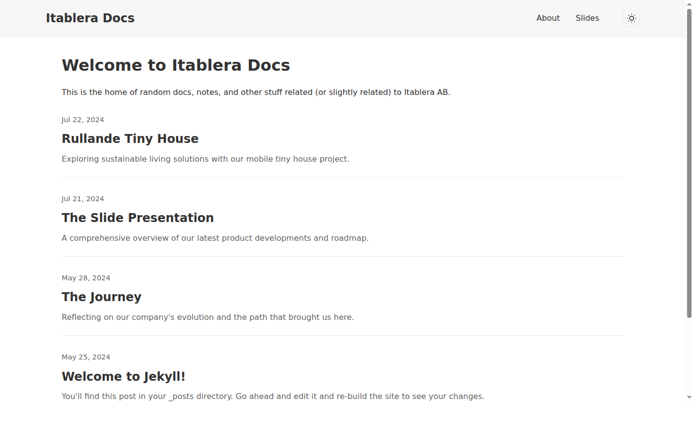
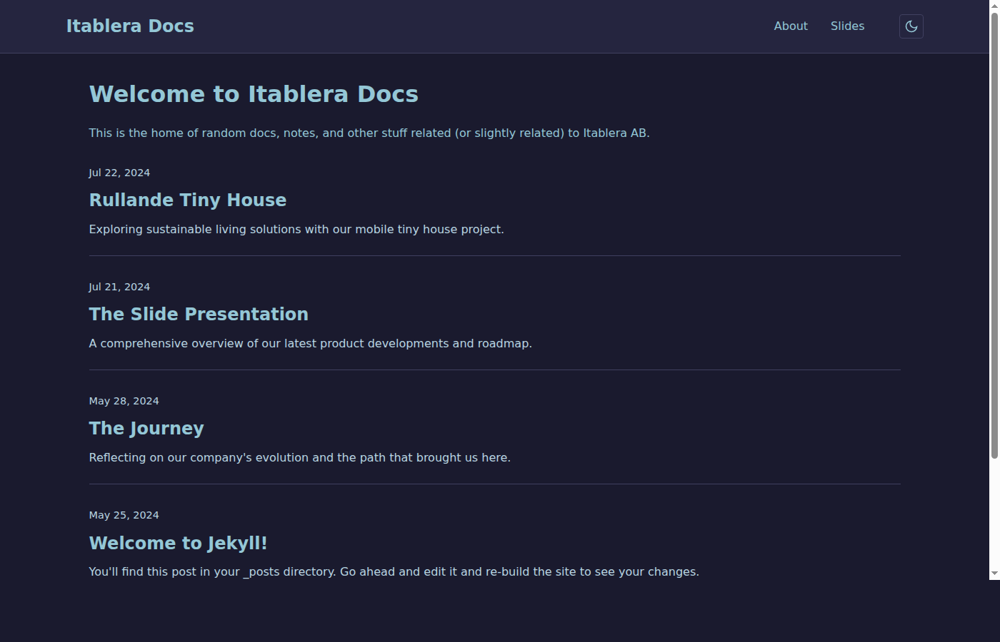
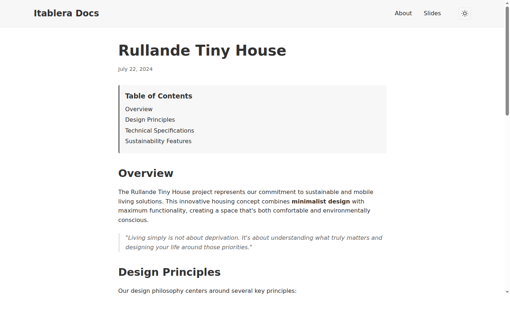
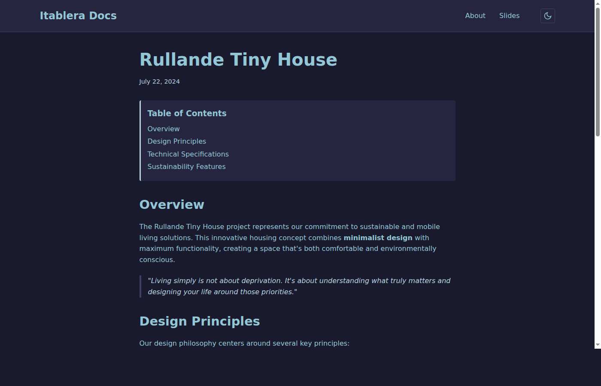
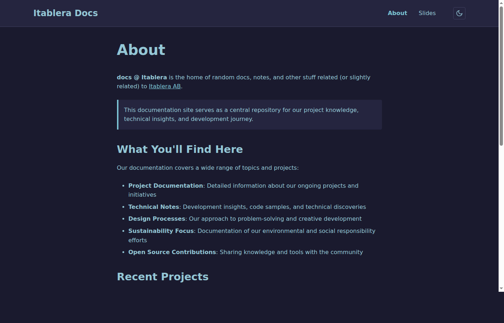

# Dark Mode Screenshots

This document showcases the dark mode implementation for the Itablera Docs Jekyll site. The screenshots demonstrate the comprehensive dark mode functionality across different page types and the smooth visual transitions.

## 1. Home Page - Light Mode

The home page in default light mode, showing the clean and minimal design with the light color scheme.

## 2. Home Page - Dark Mode

The same home page with dark mode activated, displaying the dark blue color scheme with cyan accents.

## 3. Blog Post - Light Mode

A detailed blog post view in light mode, showcasing formatted content, table of contents, and syntax highlighting.

## 4. Blog Post - Dark Mode

The same blog post in dark mode, demonstrating how all content elements (headings, text, code blocks, tables) adapt to the dark theme.

## 5. About Page - Dark Mode

The About page in dark mode, showing additional UI elements like tables, contact information boxes, and navigation highlighting.

## Key Features Demonstrated

### Color Scheme
- **Light Mode**: Clean whites and grays with blue accent links
- **Dark Mode**: Deep navy backgrounds (`#1a1a2e`, `#25253f`) with cyan text (`#94c7d6`) and links (`#7bc3d4`)

### UI Elements
- **Toggle Button**: Sun/moon icon in header navigation that changes based on current mode
- **Navigation**: Current page highlighting and hover effects
- **Content**: Properly styled headings, paragraphs, links, code blocks, tables, and quotes
- **Table of Contents**: Styled sidebar navigation for blog posts
- **Contact Boxes**: Highlighted information sections with proper contrast

### Technical Implementation
- Uses CSS custom properties for seamless theme switching
- Respects system preference with `prefers-color-scheme: dark`
- Manual override with localStorage persistence
- Smooth 0.3s transitions between modes
- No flash of unstyled content

The implementation provides a comprehensive dark mode experience that maintains excellent readability and visual hierarchy across all page types.